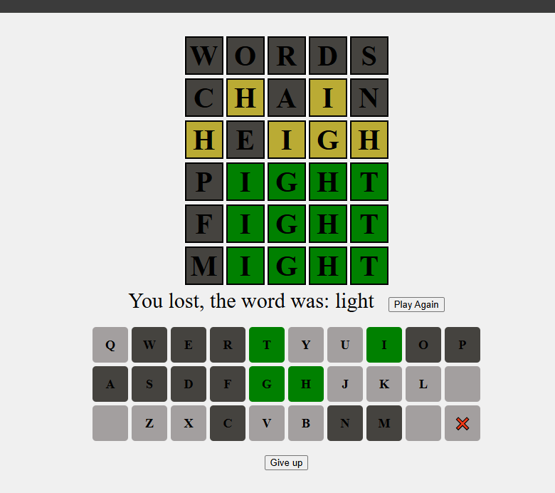

# Description
This is a copy of the game wordle that I made for fun. There is nothing superior or different about this version so it was just a fun coding project for me with no other purpose.

I am using fetch to read from the json files which means this does not work without a server because of the cross origin policy. I have been using the Visual Studio Code extension called "Live Server".

Also, I have 2 JSON files for the words. One(common_dictionary.json) is for common words which is what the random word is picked from and the other(dictionary.json) is a dictionary that has all words, including ones nobody has every heard of. I use that one for checking if something is gonna count as a real word.

Currently there is a bug. As an example if the word is "house" and you guess "freed", both of the "e"'s will be yellow. This is wrong because that implies there are 2 e's when there is only one. I have not fixed this cause I am lazy.

